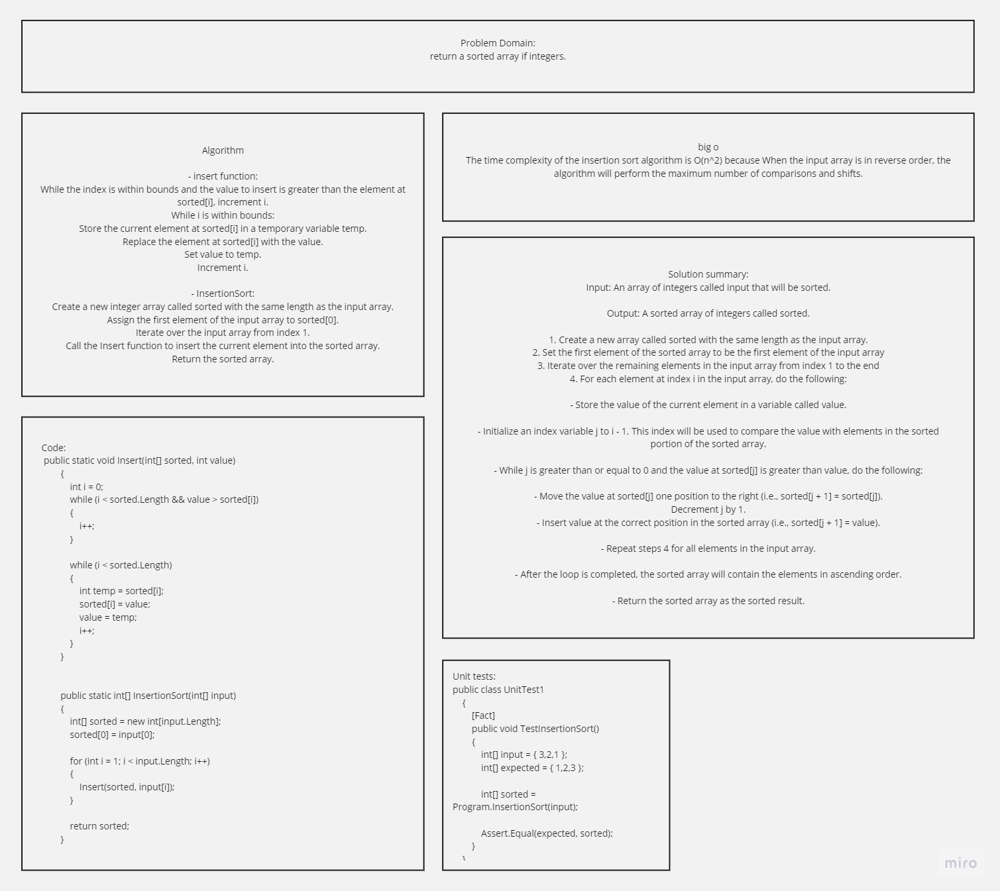

# Array sorted insertion

## problem domain
return a sorted array if integers.

## whiteboard



## Pseudocode
Insert(int[] sorted, int value)
  initialize i to 0
  WHILE value > sorted[i]
    set i to i + 1
  WHILE i < sorted.length
    set temp to sorted[i]
    set sorted[i] to value
    set value to temp
    set i to i + 1
  append value to sorted

InsertionSort(int[] input)
  LET sorted = New Empty Array
  sorted[0] = input[0]
  FOR i from 1 up to input.length
    Insert(sorted, input[i])
  return sorted

## Algorithm

- insert function:
While the index is within bounds and the value to insert is greater than the element at sorted[i], increment i.
While i is within bounds:
Store the current element at sorted[i] in a temporary variable temp.
Replace the element at sorted[i] with the value.
Set value to temp.
Increment i.

- InsertionSort:
Create a new integer array called sorted with the same length as the input array.
Assign the first element of the input array to sorted[0].
Iterate over the input array from index 1.
Call the Insert function to insert the current element into the sorted array.
Return the sorted array.


## big o
The time complexity of the insertion sort algorithm is O(n^2) because When the input array is in reverse order, the algorithm will perform the maximum number of comparisons and shifts.

## problem summary
Input: An array of integers called input that will be sorted.

Output: A sorted array of integers called sorted.

1. Create a new array called sorted with the same length as the input array.
2. Set the first element of the sorted array to be the first element of the input array
3. Iterate over the remaining elements in the input array from index 1 to the end
4. For each element at index i in the input array, do the following:

- Store the value of the current element in a variable called value.

- Initialize an index variable j to i - 1. This index will be used to compare the value with elements in the sorted portion of the sorted array.

- While j is greater than or equal to 0 and the value at sorted[j] is greater than value, do the following:

- Move the value at sorted[j] one position to the right (i.e., sorted[j + 1] = sorted[j]).
Decrement j by 1.
- Insert value at the correct position in the sorted array (i.e., sorted[j + 1] = value).

- Repeat steps 4 for all elements in the input array.

- After the loop is completed, the sorted array will contain the elements in ascending order.

- Return the sorted array as the sorted result.

## Code:
```
 public static void Insert(int[] sorted, int value)
        {
            int i = 0;
            while (i < sorted.Length && value > sorted[i])
            {
                i++;
            }

            while (i < sorted.Length)
            {
                int temp = sorted[i];
                sorted[i] = value;
                value = temp;
                i++;
            }
        }


        public static int[] InsertionSort(int[] input)
        {
            int[] sorted = new int[input.Length];
            sorted[0] = input[0];

            for (int i = 1; i < input.Length; i++)
            {
                Insert(sorted, input[i]);
            }

            return sorted;
        }
```
## Unit tests:
```
public class UnitTest1
    {
        [Fact]
        public void TestInsertionSort()
        {
            int[] input = { 3,2,1 };
            int[] expected = { 1,2,3 };

            int[] sorted = Program.InsertionSort(input);

            Assert.Equal(expected, sorted);
        }
    }
```
