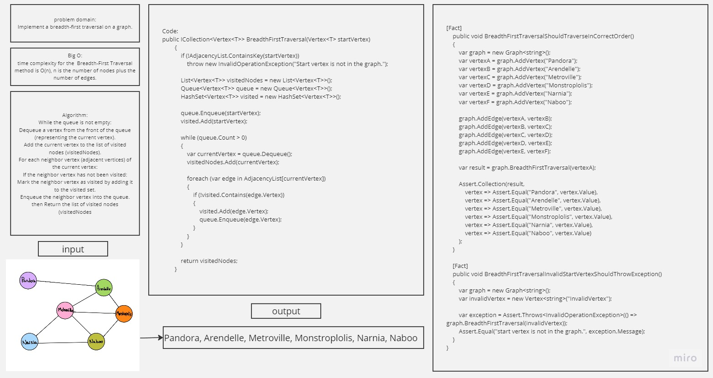

# Implement a breadth-first traversal on a graph.

## Whiteboard Process


## Approach & Efficiency
 time complexity for the  Breadth-First Traversal method is O(n), n is the number of nodes plus the number of edges.

## Solution
- Code
```
public ICollection<Vertex<T>> BreadthFirstTraversal(Vertex<T> startVertex)
        {
            if (!AdjacencyList.ContainsKey(startVertex))
                throw new InvalidOperationException("Start vertex is not in the graph.");

            List<Vertex<T>> visitedNodes = new List<Vertex<T>>();
            Queue<Vertex<T>> queue = new Queue<Vertex<T>>();
            HashSet<Vertex<T>> visited = new HashSet<Vertex<T>>();

            queue.Enqueue(startVertex);
            visited.Add(startVertex);

            while (queue.Count > 0)
            {
                var currentVertex = queue.Dequeue();
                visitedNodes.Add(currentVertex);

                foreach (var edge in AdjacencyList[currentVertex])
                {
                    if (!visited.Contains(edge.Vertex))
                    {
                        visited.Add(edge.Vertex);
                        queue.Enqueue(edge.Vertex);
                    }
                }
            }

            return visitedNodes;
        }
```
- Unit tests
```
        [Fact]
        public void BreadthFirstTraversalShouldTraverseInCorrectOrder()
        {
            var graph = new Graph<string>();
            var vertexA = graph.AddVertex("Pandora");
            var vertexB = graph.AddVertex("Arendelle");
            var vertexC = graph.AddVertex("Metroville");
            var vertexD = graph.AddVertex("Monstroplolis");
            var vertexE = graph.AddVertex("Narnia");
            var vertexF = graph.AddVertex("Naboo");

            graph.AddEdge(vertexA, vertexB);
            graph.AddEdge(vertexB, vertexC);
            graph.AddEdge(vertexC, vertexD);
            graph.AddEdge(vertexD, vertexE);
            graph.AddEdge(vertexE, vertexF);

            var result = graph.BreadthFirstTraversal(vertexA);

            Assert.Collection(result,
                vertex => Assert.Equal("Pandora", vertex.Value),
                vertex => Assert.Equal("Arendelle", vertex.Value),
                vertex => Assert.Equal("Metroville", vertex.Value),
                vertex => Assert.Equal("Monstroplolis", vertex.Value),
                vertex => Assert.Equal("Narnia", vertex.Value),
                vertex => Assert.Equal("Naboo", vertex.Value)
            );
        }

        [Fact]
        public void BreadthFirstTraversalInvalidStartVertexShouldThrowException()
        {
            var graph = new Graph<string>();
            var invalidVertex = new Vertex<string>("InvalidVertex");

            var exception = Assert.Throws<InvalidOperationException>(() => graph.BreadthFirstTraversal(invalidVertex));
            Assert.Equal("start vertex is not in the graph.", exception.Message);
        }
    }
```