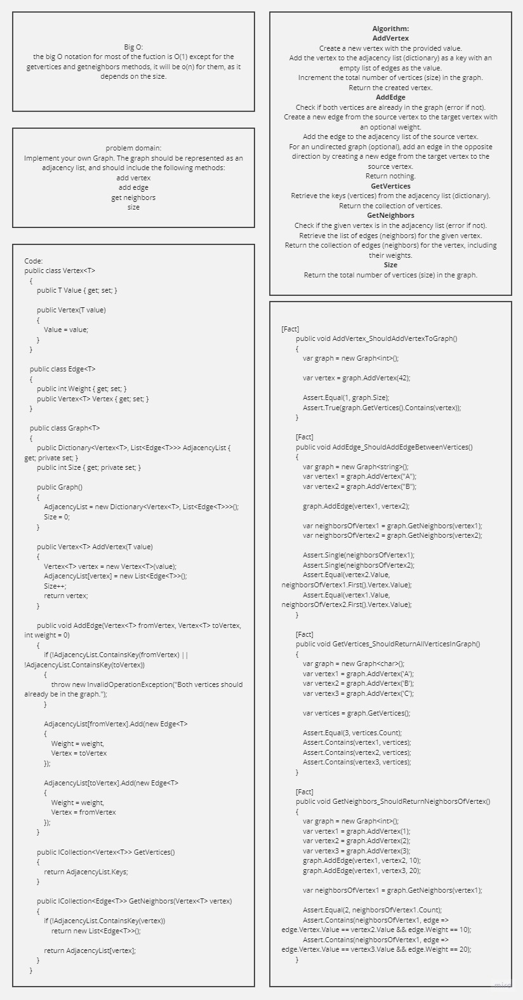

# Graphs implementation

## Whiteboard Process


## Approach & Efficiency

the big O notation for most of the fuction is O(1) except for the getvertices and getneighbors methods, it will be o(n) for them, as it depends on the size.

## Solution
- code:
```
 public class Vertex<T>
    {
        public T Value { get; set; }

        public Vertex(T value)
        {
            Value = value;
        }
    }

    public class Edge<T>
    {
        public int Weight { get; set; }
        public Vertex<T> Vertex { get; set; }
    }

    public class Graph<T>
    {
        public Dictionary<Vertex<T>, List<Edge<T>>> AdjacencyList { get; private set; }
        public int Size { get; private set; }

        public Graph()
        {
            AdjacencyList = new Dictionary<Vertex<T>, List<Edge<T>>>();
            Size = 0;
        }

        public Vertex<T> AddVertex(T value)
        {
            Vertex<T> vertex = new Vertex<T>(value);
            AdjacencyList[vertex] = new List<Edge<T>>();
            Size++;
            return vertex;
        }

        public void AddEdge(Vertex<T> fromVertex, Vertex<T> toVertex, int weight = 0)
        {
            if (!AdjacencyList.ContainsKey(fromVertex) || !AdjacencyList.ContainsKey(toVertex))
            {
                throw new InvalidOperationException("Both vertices should already be in the graph.");
            }

            AdjacencyList[fromVertex].Add(new Edge<T>
            {
                Weight = weight,
                Vertex = toVertex
            });

            AdjacencyList[toVertex].Add(new Edge<T>
            {
                Weight = weight,
                Vertex = fromVertex
            });
        }

        public ICollection<Vertex<T>> GetVertices()
        {
            return AdjacencyList.Keys;
        }

        public ICollection<Edge<T>> GetNeighbors(Vertex<T> vertex)
        {
            if (!AdjacencyList.ContainsKey(vertex))
                return new List<Edge<T>>();

            return AdjacencyList[vertex];
        }
    }

```
- unit tests:
```
[Fact]
        public void AddVertex_ShouldAddVertexToGraph()
        {
            var graph = new Graph<int>();

            var vertex = graph.AddVertex(42);

            Assert.Equal(1, graph.Size);
            Assert.True(graph.GetVertices().Contains(vertex));
        }

        [Fact]
        public void AddEdge_ShouldAddEdgeBetweenVertices()
        {
            var graph = new Graph<string>();
            var vertex1 = graph.AddVertex("A");
            var vertex2 = graph.AddVertex("B");

            graph.AddEdge(vertex1, vertex2);

            var neighborsOfVertex1 = graph.GetNeighbors(vertex1);
            var neighborsOfVertex2 = graph.GetNeighbors(vertex2);

            Assert.Single(neighborsOfVertex1);
            Assert.Single(neighborsOfVertex2);
            Assert.Equal(vertex2.Value, neighborsOfVertex1.First().Vertex.Value);
            Assert.Equal(vertex1.Value, neighborsOfVertex2.First().Vertex.Value);
        }

        [Fact]
        public void GetVertices_ShouldReturnAllVerticesInGraph()
        {
            var graph = new Graph<char>();
            var vertex1 = graph.AddVertex('A');
            var vertex2 = graph.AddVertex('B');
            var vertex3 = graph.AddVertex('C');

            var vertices = graph.GetVertices();

            Assert.Equal(3, vertices.Count);
            Assert.Contains(vertex1, vertices);
            Assert.Contains(vertex2, vertices);
            Assert.Contains(vertex3, vertices);
        }

        [Fact]
        public void GetNeighbors_ShouldReturnNeighborsOfVertex()
        {
            var graph = new Graph<int>();
            var vertex1 = graph.AddVertex(1);
            var vertex2 = graph.AddVertex(2);
            var vertex3 = graph.AddVertex(3);
            graph.AddEdge(vertex1, vertex2, 10);
            graph.AddEdge(vertex1, vertex3, 20);

            var neighborsOfVertex1 = graph.GetNeighbors(vertex1);

            Assert.Equal(2, neighborsOfVertex1.Count);
            Assert.Contains(neighborsOfVertex1, edge => edge.Vertex.Value == vertex2.Value && edge.Weight == 10);
            Assert.Contains(neighborsOfVertex1, edge => edge.Vertex.Value == vertex3.Value && edge.Weight == 20);
        }
```