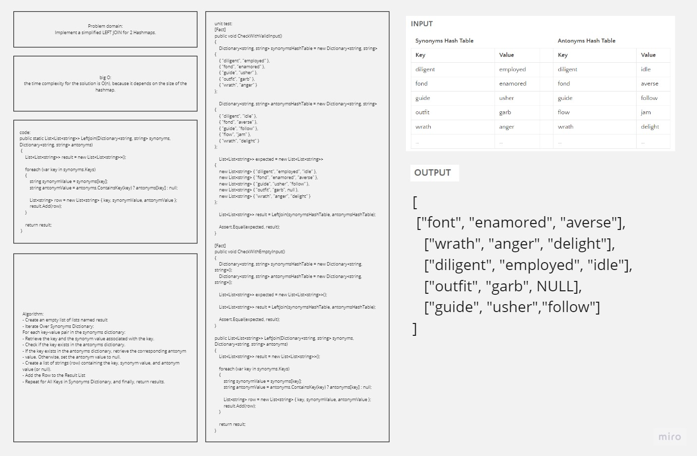

# Implement a simplified LEFT JOIN for 2 Hashmaps.

## Whiteboard Process


## Approach & Efficiency
the time complexity for the solution is O(n), because it depends on the size of the hashmap.

## Solution
- Code:
```
 public static List<List<string>> LeftJoin(Dictionary<string, string> synonyms, Dictionary<string, string> antonyms)
    {
        List<List<string>> result = new List<List<string>>();

        foreach (var key in synonyms.Keys)
        {
            string synonymValue = synonyms[key];
            string antonymValue = antonyms.ContainsKey(key) ? antonyms[key] : null;

            List<string> row = new List<string> { key, synonymValue, antonymValue };
            result.Add(row);
        }

        return result;
    }
```

- Unit tests:
```
[Fact]
        public void CheckWithValidInput()
        {
            Dictionary<string, string> synonymsHashTable = new Dictionary<string, string>
        {
            { "diligent", "employed" },
            { "fond", "enamored" },
            { "guide", "usher" },
            { "outfit", "garb" },
            { "wrath", "anger" }
        };

            Dictionary<string, string> antonymsHashTable = new Dictionary<string, string>
        {
            { "diligent", "idle" },
            { "fond", "averse" },
            { "guide", "follow" },
            { "flow", "jam" },
            { "wrath", "delight" }
        };

            List<List<string>> expected = new List<List<string>>
        {
            new List<string> { "diligent", "employed", "idle" },
            new List<string> { "fond", "enamored", "averse" },
            new List<string> { "guide", "usher", "follow" },
            new List<string> { "outfit", "garb", null },
            new List<string> { "wrath", "anger", "delight" }
        };

            List<List<string>> result = LeftJoin(synonymsHashTable, antonymsHashTable);

            Assert.Equal(expected, result);
        }

        [Fact]
        public void CheckWithEmptyInput()
        {
            Dictionary<string, string> synonymsHashTable = new Dictionary<string, string>();
            Dictionary<string, string> antonymsHashTable = new Dictionary<string, string>();

            List<List<string>> expected = new List<List<string>>();

            List<List<string>> result = LeftJoin(synonymsHashTable, antonymsHashTable);

            Assert.Equal(expected, result);
        }

        public List<List<string>> LeftJoin(Dictionary<string, string> synonyms, Dictionary<string, string> antonyms)
        {
            List<List<string>> result = new List<List<string>>();

            foreach (var key in synonyms.Keys)
            {
                string synonymValue = synonyms[key];
                string antonymValue = antonyms.ContainsKey(key) ? antonyms[key] : null;

                List<string> row = new List<string> { key, synonymValue, antonymValue };
                result.Add(row);
            }

            return result;
        }
```