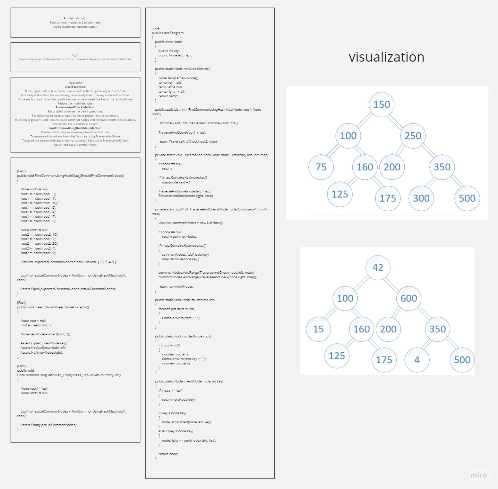

# Find common values in 2 binary trees.

## Whiteboard Process

## Approach & Efficiency
time complexity for the functions is O(n), because it depends on the size of the tree.
## Solution
- Code:
```
public class Program
{
    public class Node
    {
        public int key;
        public Node left, right;
    }

    public static Node newNode(int ele)
    {
        Node temp = new Node();
        temp.key = ele;
        temp.left = null;
        temp.right = null;
        return temp;
    }

    public static List<int> FindCommonUsingHashMap(Node root1, Node root2)
    {
        Dictionary<int, int> map = new Dictionary<int, int>();

        TraverseAndStore(root1, map);

        return TraverseAndCheck(root2, map);
    }

    private static void TraverseAndStore(Node node, Dictionary<int, int> map)
    {
        if (node == null)
            return;

        if (!map.ContainsKey(node.key))
            map[node.key] = 1;

        TraverseAndStore(node.left, map);
        TraverseAndStore(node.right, map);
    }

    private static List<int> TraverseAndCheck(Node node, Dictionary<int, int> map)
    {
        List<int> commonNodes = new List<int>();

        if (node == null)
            return commonNodes;

        if (map.ContainsKey(node.key))
        {
            commonNodes.Add(node.key);
            map.Remove(node.key);
        }

        commonNodes.AddRange(TraverseAndCheck(node.left, map));
        commonNodes.AddRange(TraverseAndCheck(node.right, map));

        return commonNodes;
    }

    public static void PrintList(List<int> list)
    {
        foreach (int item in list)
        {
            Console.Write(item + " ");
        }
    }

    public static void inorder(Node root)
    {
        if (root != null)
        {
            inorder(root.left);
            Console.Write(root.key + " ");
            inorder(root.right);
        }
    }

    public static Node insert(Node node, int key)
    {
        if (node == null)
        {
            return newNode(key);
        }

        if (key < node.key)
        {
            node.left = insert(node.left, key);
        }
        else if (key > node.key)
        {
            node.right = insert(node.right, key);
        }

        return node;
    }
```

- Unit tests:
```
[Fact]
        public void FindCommonUsingHashMap_ShouldFindCommonNodes()
        {

            Node root1 = null;
            root1 = insert(root1, 5);
            root1 = insert(root1, 1);
            root1 = insert(root1, 10);
            root1 = insert(root1, 0);
            root1 = insert(root1, 4);
            root1 = insert(root1, 7);
            root1 = insert(root1, 9);

            Node root2 = null;
            root2 = insert(root2, 10);
            root2 = insert(root2, 7);
            root2 = insert(root2, 20);
            root2 = insert(root2, 4);
            root2 = insert(root2, 9);

            List<int> expectedCommonNodes = new List<int> { 10, 7, 4, 9 };


            List<int> actualCommonNodes = FindCommonUsingHashMap(root1, root2);

            Assert.Equal(expectedCommonNodes, actualCommonNodes);
        }

        [Fact]
        public void Insert_ShouldInsertNodeCorrectly()
        {

            Node root = null;
            root = insert(root, 5);

            Node newNode = insert(root, 3);

            Assert.Equal(5, newNode.key);
            Assert.NotNull(newNode.left);
            Assert.Null(newNode.right);
        }

        [Fact]
        public void FindCommonUsingHashMap_EmptyTrees_ShouldReturnEmptyList()
        {

            Node root1 = null;
            Node root2 = null;


            List<int> actualCommonNodes = FindCommonUsingHashMap(root1, root2);

            Assert.Empty(actualCommonNodes);
        }
```