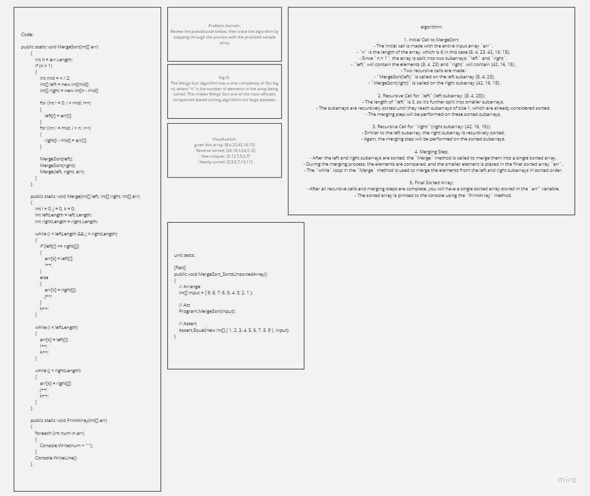

# Merge Sort

## Problem domain
Review the pseudocode below, then trace the algorithm by stepping through the process with the provided sample array

## big O

The Merge Sort algorithm has a time complexity of O(n log n), where "n" is the number of elements in the array being sorted. This makes Merge Sort one of the most efficient comparison-based sorting algorithms for large datasets.

## Whiteboard



## Visualization:
#### given this array: [8,4,23,42,16,15]

- Reverse-sorted: [20,18,12,8,5,-2]
- Few uniques: [5,12,7,5,5,7]
- Nearly-sorted: [2,3,5,7,13,11]

## Pseudo Code
```
ALGORITHM Mergesort(arr)
    DECLARE n <-- arr.length

    if n > 1
      DECLARE mid <-- n/2
      DECLARE left <-- arr[0...mid]
      DECLARE right <-- arr[mid...n]
      // sort the left side
      Mergesort(left)
      // sort the right side
      Mergesort(right)
      // merge the sorted left and right sides together
      Merge(left, right, arr)

ALGORITHM Merge(left, right, arr)
    DECLARE i <-- 0
    DECLARE j <-- 0
    DECLARE k <-- 0

    while i < left.length && j < right.length
        if left[i] <= right[j]
            arr[k] <-- left[i]
            i <-- i + 1
        else
            arr[k] <-- right[j]
            j <-- j + 1

        k <-- k + 1

    if i = left.length
       set remaining entries in arr to remaining values in right
    else
       set remaining entries in arr to remaining values in left
```

## algorithm walkthrough :

Walkthrough of the Code:

1. **Initial Call to MergeSort**:
   - The initial call is made with the entire input array `arr`.
   - `n` is the length of the array, which is 6 in this case (8, 4, 23, 42, 16, 15).
   - Since `n > 1`, the array is split into two subarrays: `left` and `right`.
   - `left` will contain the elements {8, 4, 23} and `right` will contain {42, 16, 15}.
   - Two recursive calls are made:
     - `MergeSort(left)` is called on the left subarray {8, 4, 23}.
     - `MergeSort(right)` is called on the right subarray {42, 16, 15}.

2. **Recursive Call for `left` (left subarray: {8, 4, 23})**:
   - The length of `left` is 3, so it's further split into smaller subarrays.
   - The subarrays are recursively sorted until they reach subarrays of size 1, which are already considered sorted.
   - The merging step will be performed on these sorted subarrays.

3. **Recursive Call for `right` (right subarray: {42, 16, 15})**:
   - Similar to the left subarray, the right subarray is recursively sorted.
   - Again, the merging step will be performed on the sorted subarrays.

4. **Merging Step**:
   - After the left and right subarrays are sorted, the `Merge` method is called to merge them into a single sorted array.
   - During the merging process, the elements are compared, and the smaller element is placed in the final sorted array `arr`.
   - The `while` loop in the `Merge` method is used to merge the elements from the left and right subarrays in sorted order.

5. **Final Sorted Array**:
   - After all recursive calls and merging steps are complete, you will have a single sorted array stored in the `arr` variable.
   - The sorted array is printed to the console using the `PrintArray` method.


## Code
```
public static void MergeSort(int[] arr)
        {
            int n = arr.Length;
            if (n > 1)
            {
                int mid = n / 2;
                int[] left = new int[mid];
                int[] right = new int[n - mid];

                for (int i = 0; i < mid; i++)
                {
                    left[i] = arr[i];
                }
                for (int i = mid; i < n; i++)
                {
                    right[i - mid] = arr[i];
                }

                MergeSort(left);
                MergeSort(right);
                Merge(left, right, arr);
            }
        }

        public static void Merge(int[] left, int[] right, int[] arr)
        {
            int i = 0, j = 0, k = 0;
            int leftLength = left.Length;
            int rightLength = right.Length;

            while (i < leftLength && j < rightLength)
            {
                if (left[i] <= right[j])
                {
                    arr[k] = left[i];
                    i++;
                }
                else
                {
                    arr[k] = right[j];
                    j++;
                }
                k++;
            }

            while (i < leftLength)
            {
                arr[k] = left[i];
                i++;
                k++;
            }

            while (j < rightLength)
            {
                arr[k] = right[j];
                j++;
                k++;
            }
        }

        public static void PrintArray(int[] arr)
        {
            foreach (int num in arr)
            {
                Console.Write(num + " ");
            }
            Console.WriteLine();
        }
```

## unit tests
```
        [Fact]
        public void MergeSort_SortsUnsortedArray()
        {
            // Arrange
            int[] input = { 9, 8, 7, 6, 5, 4, 3, 2, 1 };

            // Act
            Program.MergeSort(input);

            // Assert
            Assert.Equal(new int[] { 1, 2, 3, 4, 5, 6, 7, 8, 9 }, input);
        }
```

