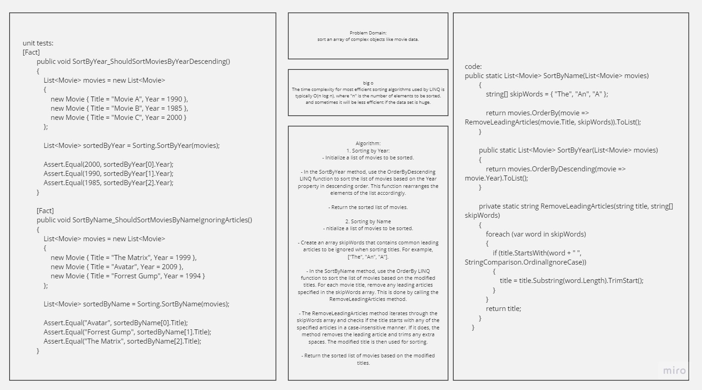

# Sorting: Comparisons

## Whiteboard 


## Problem Domain:

sort an array of complex objects like movie data.

## big o

The time complexity for most efficient sorting algorithms used by LINQ is typically O(n log n), where "n" is the number of elements to be sorted.
and sometimes it will be less efficient if the data set is huge.

## Algorithm
1. Sorting by Year:
- Initialize a list of movies to be sorted.

- In the SortByYear method, use the OrderByDescending LINQ function to sort the list of movies based on the Year property in descending order. This function rearranges the elements of the list accordingly.

- Return the sorted list of movies.

2. Sorting by Name
- nitialize a list of movies to be sorted.

- Create an array skipWords that contains common leading articles to be ignored when sorting titles. For example, ["The", "An", "A"].

- In the SortByName method, use the OrderBy LINQ function to sort the list of movies based on the modified titles. For each movie title, remove any leading articles specified in the skipWords array. This is done by calling the RemoveLeadingArticles method.

- The RemoveLeadingArticles method iterates through the skipWords array and checks if the title starts with any of the specified articles in a case-insensitive manner. If it does, the method removes the leading article and trims any extra spaces. The modified title is then used for sorting.

- Return the sorted list of movies based on the modified titles.

## Code
```
public static List<Movie> SortByName(List<Movie> movies)
        {
            string[] skipWords = { "The", "An", "A" };

            return movies.OrderBy(movie => RemoveLeadingArticles(movie.Title, skipWords)).ToList();
        }

        public static List<Movie> SortByYear(List<Movie> movies)
        {
            return movies.OrderByDescending(movie => movie.Year).ToList();
        }

        private static string RemoveLeadingArticles(string title, string[] skipWords)
        {
            foreach (var word in skipWords)
            {
                if (title.StartsWith(word + " ", StringComparison.OrdinalIgnoreCase))
                {
                    title = title.Substring(word.Length).TrimStart();
                }
            }
            return title;
        }
    }
```
## unit tests:
```
[Fact]
        public void SortByYear_ShouldSortMoviesByYearDescending()
        {
            List<Movie> movies = new List<Movie>
            {
                new Movie { Title = "Movie A", Year = 1990 },
                new Movie { Title = "Movie B", Year = 1985 },
                new Movie { Title = "Movie C", Year = 2000 }
            };

            List<Movie> sortedByYear = Sorting.SortByYear(movies);

            Assert.Equal(2000, sortedByYear[0].Year);
            Assert.Equal(1990, sortedByYear[1].Year);
            Assert.Equal(1985, sortedByYear[2].Year);
        }

        [Fact]
        public void SortByName_ShouldSortMoviesByNameIgnoringArticles()
        {
            List<Movie> movies = new List<Movie>
            {
                new Movie { Title = "The Matrix", Year = 1999 },
                new Movie { Title = "Avatar", Year = 2009 },
                new Movie { Title = "Forrest Gump", Year = 1994 }
            };

            List<Movie> sortedByName = Sorting.SortByName(movies);

            Assert.Equal("Avatar", sortedByName[0].Title);
            Assert.Equal("Forrest Gump", sortedByName[1].Title);
            Assert.Equal("The Matrix", sortedByName[2].Title);
        }
```