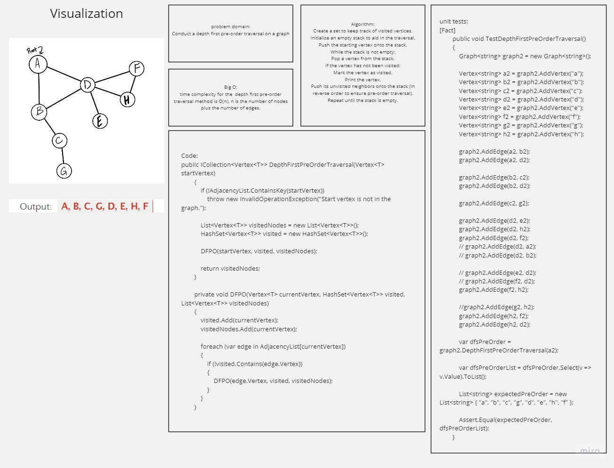

# depth first pre-order traversal on a graph

## app implementation is here: https://github.com/Hasan-Mufdy/data-structures-and-algorithms/tree/main/Graphs/GraphImplementation

## Whiteboard Process


## Approach & Efficiency
 time complexity for the  depth first pre-order traversal method is O(n), n is the number of nodes plus the number of edges.

## Solution
- Code:
```
public ICollection<Vertex<T>> DepthFirstPreOrderTraversal(Vertex<T> startVertex)
        {
            if (!AdjacencyList.ContainsKey(startVertex))
                throw new InvalidOperationException("Start vertex is not in the graph.");

            List<Vertex<T>> visitedNodes = new List<Vertex<T>>();
            HashSet<Vertex<T>> visited = new HashSet<Vertex<T>>();

            DFPO(startVertex, visited, visitedNodes);

            return visitedNodes;
        }

        private void DFPO(Vertex<T> currentVertex, HashSet<Vertex<T>> visited, List<Vertex<T>> visitedNodes)
        {
            visited.Add(currentVertex);
            visitedNodes.Add(currentVertex);

            foreach (var edge in AdjacencyList[currentVertex])
            {
                if (!visited.Contains(edge.Vertex))
                {
                    DFPO(edge.Vertex, visited, visitedNodes);
                }
            }
        }
```

- unit tests:
```
[Fact]
        public void TestDepthFirstPreOrderTraversal()
        {
            Graph<string> graph2 = new Graph<string>();

            Vertex<string> a2 = graph2.AddVertex("a");
            Vertex<string> b2 = graph2.AddVertex("b");
            Vertex<string> c2 = graph2.AddVertex("c");
            Vertex<string> d2 = graph2.AddVertex("d");
            Vertex<string> e2 = graph2.AddVertex("e");
            Vertex<string> f2 = graph2.AddVertex("f");
            Vertex<string> g2 = graph2.AddVertex("g");
            Vertex<string> h2 = graph2.AddVertex("h");

            graph2.AddEdge(a2, b2);
            graph2.AddEdge(a2, d2);

            graph2.AddEdge(b2, c2);
            graph2.AddEdge(b2, d2);

            graph2.AddEdge(c2, g2);

            graph2.AddEdge(d2, e2);
            graph2.AddEdge(d2, h2);
            graph2.AddEdge(d2, f2);
            // graph2.AddEdge(d2, a2);
            // graph2.AddEdge(d2, b2);

            // graph2.AddEdge(e2, d2);
            // graph2.AddEdge(f2, d2);
            graph2.AddEdge(f2, h2);

            //graph2.AddEdge(g2, h2);
            graph2.AddEdge(h2, f2);
            graph2.AddEdge(h2, d2);

            var dfsPreOrder = graph2.DepthFirstPreOrderTraversal(a2);

            var dfsPreOrderList = dfsPreOrder.Select(v => v.Value).ToList();

            List<string> expectedPreOrder = new List<string> { "a", "b", "c", "g", "d", "e", "h", "f" };

            Assert.Equal(expectedPreOrder, dfsPreOrderList);
        }
```