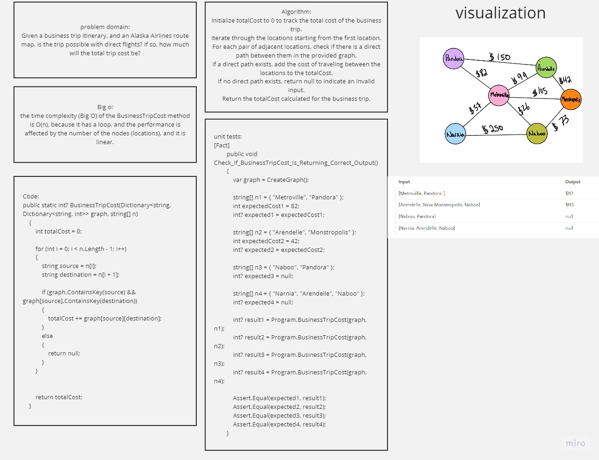

# Graph Business Trip
Given a business trip itinerary, and an Alaska Airlines route map, is the trip possible with direct flights? If so, how much will the total trip cost be?

## Whiteboard Process


## Approach & Efficiency
the time complexity (Big O) of the BusinessTripCost method is O(n), because it has a loop, and the performance is affected by the number of the nodes (locations), and it is linear.


## Solution
- Code:
```
public static int? BusinessTripCost(Dictionary<string, Dictionary<string, int>> graph, string[] n)
    {
        int totalCost = 0;

        for (int i = 0; i < n.Length - 1; i++)
        {
            string source = n[i];
            string destination = n[i + 1];

            if (graph.ContainsKey(source) && graph[source].ContainsKey(destination))
            {
                totalCost += graph[source][destination];
            }
            else
            {
                return null;
            }
        }


        return totalCost;
    }
```

- Unit tests:
```
[Fact]
        public void Check_If_BusinessTripCost_Is_Returning_Correct_Output()
        {
            var graph = CreateGraph();

            string[] n1 = { "Metroville", "Pandora" };
            int expectedCost1 = 82;
            int? expected1 = expectedCost1;

            string[] n2 = { "Arendelle", "Monstropolis" };
            int expectedCost2 = 42;
            int? expected2 = expectedCost2;

            string[] n3 = { "Naboo", "Pandora" };
            int? expected3 = null;

            string[] n4 = { "Narnia", "Arendelle", "Naboo" };
            int? expected4 = null;

            int? result1 = Program.BusinessTripCost(graph, n1);
            int? result2 = Program.BusinessTripCost(graph, n2);
            int? result3 = Program.BusinessTripCost(graph, n3);
            int? result4 = Program.BusinessTripCost(graph, n4);

            Assert.Equal(expected1, result1);
            Assert.Equal(expected2, result2);
            Assert.Equal(expected3, result3);
            Assert.Equal(expected4, result4);
        }
```