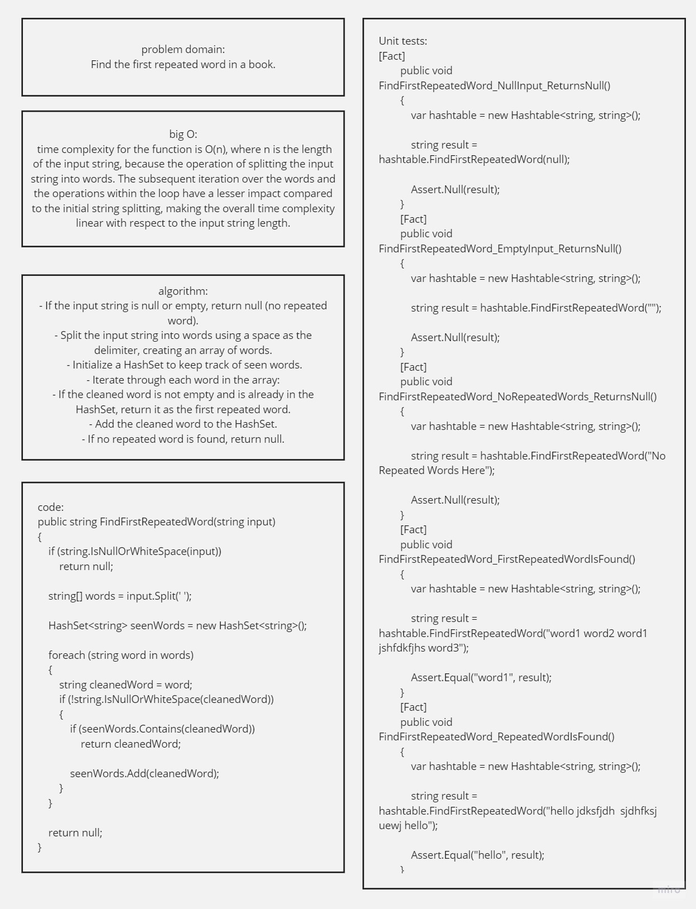

# Find the first repeated word in a book.

## implementation: 
https://github.com/Hasan-Mufdy/data-structures-and-algorithms/tree/main/hashtable/HashTables

## Whiteboard Process


## Approach & Efficiency
time complexity for the function is O(n), where n is the length of the input string, because the operation of splitting the input string into words. The subsequent iteration over the words and the operations within the loop have a lesser impact compared to the initial string splitting, making the overall time complexity linear with respect to the input string length.

## Solution
- code:
```
        public string FindFirstRepeatedWord(string input)
        {
            if (string.IsNullOrWhiteSpace(input))
                return null;

            string[] words = input.Split(' ');

            HashSet<string> seenWords = new HashSet<string>();

            foreach (string word in words)
            {
                string cleanedWord = word;
                if (!string.IsNullOrWhiteSpace(cleanedWord))
                {
                    if (seenWords.Contains(cleanedWord))
                        return cleanedWord;

                    seenWords.Add(cleanedWord);
                }
            }

            return null;
        }
```

- unit tests
```
[Fact]
        public void FindFirstRepeatedWord_NullInput_ReturnsNull()
        {
            var hashtable = new Hashtable<string, string>();

            string result = hashtable.FindFirstRepeatedWord(null);

            Assert.Null(result);
        }
        [Fact]
        public void FindFirstRepeatedWord_EmptyInput_ReturnsNull()
        {
            var hashtable = new Hashtable<string, string>();

            string result = hashtable.FindFirstRepeatedWord("");

            Assert.Null(result);
        }
        [Fact]
        public void FindFirstRepeatedWord_NoRepeatedWords_ReturnsNull()
        {
            var hashtable = new Hashtable<string, string>();

            string result = hashtable.FindFirstRepeatedWord("No Repeated Words Here");

            Assert.Null(result);
        }
        [Fact]
        public void FindFirstRepeatedWord_FirstRepeatedWordIsFound()
        {
            var hashtable = new Hashtable<string, string>();

            string result = hashtable.FindFirstRepeatedWord("word1 word2 word1 jshfdkfjhs word3");

            Assert.Equal("word1", result);
        }
        [Fact]
        public void FindFirstRepeatedWord_RepeatedWordIsFound()
        {
            var hashtable = new Hashtable<string, string>();

            string result = hashtable.FindFirstRepeatedWord("hello jdksfjdh  sjdhfksj uewj hello");

            Assert.Equal("hello", result);
        }
```