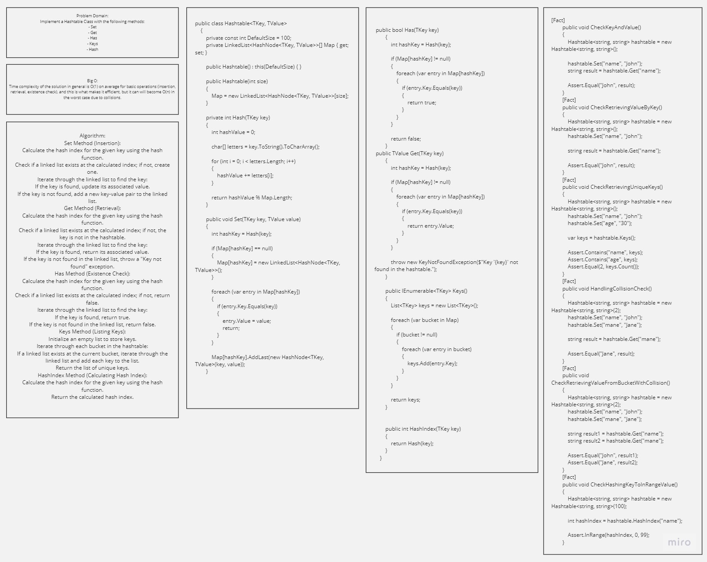

# Hash Table Implementation

## Whiteboard Process



## Approach & Efficiency

Time complexity of the solution in general is O(1) on average for basic operations (insertion, retrieval, existence check), and this is what makes it efficient, but it can will become O(n) in the worst case due to collisions.

## Code
```
public class Hashtable<TKey, TValue>
    {
        private const int DefaultSize = 100;
        private LinkedList<HashNode<TKey, TValue>>[] Map { get; set; }

        public Hashtable() : this(DefaultSize) { }

        public Hashtable(int size)
        {
            Map = new LinkedList<HashNode<TKey, TValue>>[size];
        }

        private int Hash(TKey key)
        {
            int hashValue = 0;

            char[] letters = key.ToString().ToCharArray();

            for (int i = 0; i < letters.Length; i++)
            {
                hashValue += letters[i];
            }

            return hashValue % Map.Length;
        }

        public void Set(TKey key, TValue value)
        {
            int hashKey = Hash(key);

            if (Map[hashKey] == null)
            {
                Map[hashKey] = new LinkedList<HashNode<TKey, TValue>>();
            }

            foreach (var entry in Map[hashKey])
            {
                if (entry.Key.Equals(key))
                {
                    entry.Value = value;
                    return;
                }
            }

            Map[hashKey].AddLast(new HashNode<TKey, TValue>(key, value));
        }

        

        public bool Has(TKey key)
        {
            int hashKey = Hash(key);

            if (Map[hashKey] != null)
            {
                foreach (var entry in Map[hashKey])
                {
                    if (entry.Key.Equals(key))
                    {
                        return true;
                    }
                }
            }

            return false;
        }

        public TValue Get(TKey key)
        {
            int hashKey = Hash(key);

            if (Map[hashKey] != null)
            {
                foreach (var entry in Map[hashKey])
                {
                    if (entry.Key.Equals(key))
                    {
                        return entry.Value;
                    }
                }
            }

            throw new KeyNotFoundException($"Key '{key}' not found in the hashtable.");
        }

        public IEnumerable<TKey> Keys()
        {
            List<TKey> keys = new List<TKey>();

            foreach (var bucket in Map)
            {
                if (bucket != null)
                {
                    foreach (var entry in bucket)
                    {
                        keys.Add(entry.Key);
                    }
                }
            }

            return keys;
        }


        public int HashIndex(TKey key)
        {
            return Hash(key);
        }
    }
```


## Unit tests
```
[Fact]
        public void CheckKeyAndValue()
        {
            Hashtable<string, string> hashtable = new Hashtable<string, string>();

            hashtable.Set("name", "John");
            string result = hashtable.Get("name");

            Assert.Equal("John", result);
        }
        [Fact]
        public void CheckRetrievingValueByKey()
        {
            Hashtable<string, string> hashtable = new Hashtable<string, string>();
            hashtable.Set("name", "John");

            string result = hashtable.Get("name");

            Assert.Equal("John", result);
        }
        [Fact]
        public void CheckRetrievingUniqueKeys()
        {
            Hashtable<string, string> hashtable = new Hashtable<string, string>();
            hashtable.Set("name", "John");
            hashtable.Set("age", "30");

            var keys = hashtable.Keys();

            Assert.Contains("name", keys);
            Assert.Contains("age", keys);
            Assert.Equal(2, keys.Count());
        }
        [Fact]
        public void HandlingCollisionCheck()
        {
            Hashtable<string, string> hashtable = new Hashtable<string, string>(2);
            hashtable.Set("name", "John");
            hashtable.Set("mane", "Jane");

            string result = hashtable.Get("mane");

            Assert.Equal("Jane", result);
        }
        [Fact]
        public void CheckRetrievingValueFromBucketWithCollision()
        {
            Hashtable<string, string> hashtable = new Hashtable<string, string>(2);
            hashtable.Set("name", "John");
            hashtable.Set("mane", "Jane");

            string result1 = hashtable.Get("name");
            string result2 = hashtable.Get("mane");

            Assert.Equal("John", result1);
            Assert.Equal("Jane", result2);
        }
        [Fact]
        public void CheckHashingKeyToInRangeValue()
        {
            Hashtable<string, string> hashtable = new Hashtable<string, string>(100);

            int hashIndex = hashtable.HashIndex("name");

            Assert.InRange(hashIndex, 0, 99);
        }
```